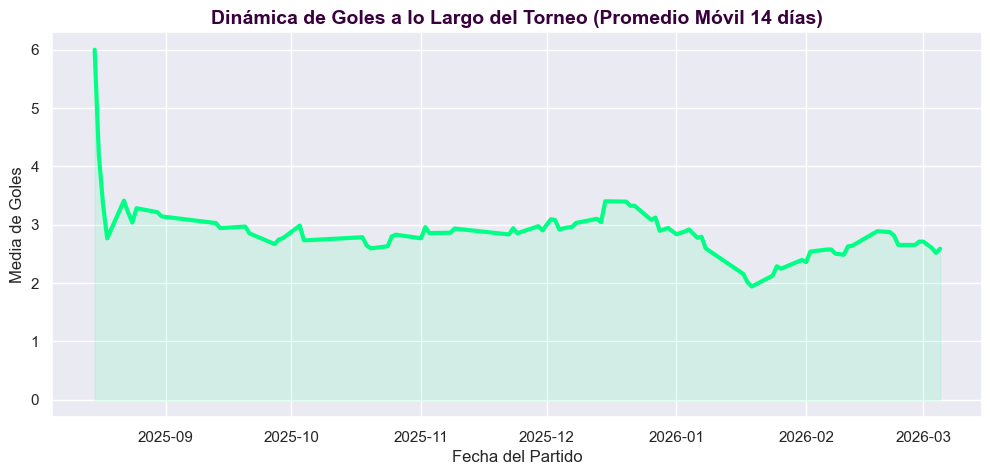
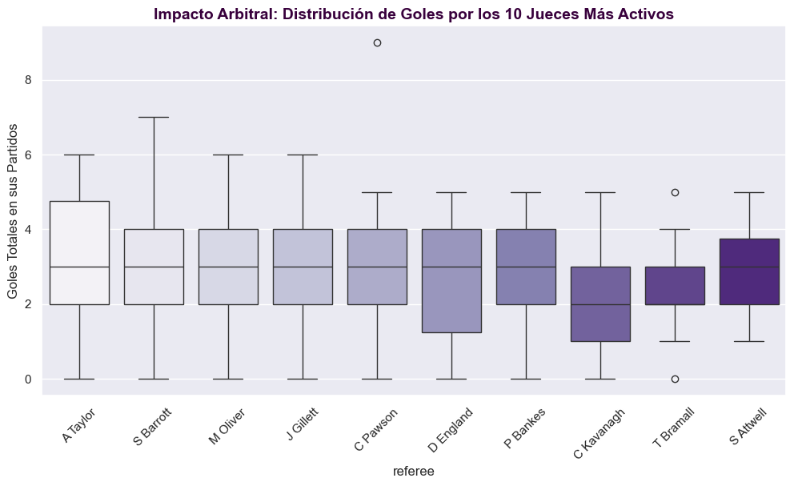
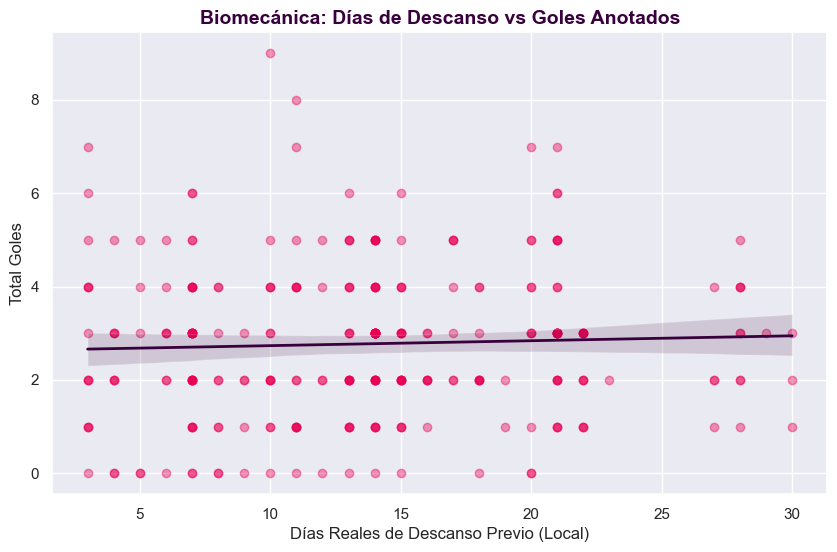

# Taller 2: ¿Puedes Predecir el Fútbol Mejor que las Casas de Apuestas? (Modelo 2)

Este documento contiene la bitácora analítica y la solución estructural del **Modelo 2**, cuyo objetivo implacable es predecir el volumen continuo y exacto de goles de un partido (`total_goals`), utilizando estrictamente información previa al saque inicial para neutralizar por completo el fantasma del **Data Leakage**.

## 📂 Estructura del Proyecto (Workflow Colaborativo)

Para coordinar la creación de los modelos junto con el `Modelo 1 (xG)`, nuestro repositorio está esquematizado de la siguiente manera:

```text
TALLER 2/
├── data/
│   ├── players.csv, matches.csv, events.csv # Datos base crudos de API
│   ├── matches_golden_features.csv          # [ENTREGABLE M2] Matriz de Oro V3
├── img/                                     # Heatmaps e Histogramas
├── scripts/                                 # [ARQUITECTURA DE CÓDIGO]
│   ├── generales/download_data.py           # Recolector masivo
│   ├── modelo_1_xg/...                      # Modelo de Expected Goals
│   └── modelo_2_partidos/                   # [PIPELINE M2 - Goles Totales]
│       ├── brute_force_spearman.py          # Escáner de Correlación
│       ├── create_match_features.py         # Creador del Golden Dataset (Anti-Leakage)
│       ├── verificar_supuestos.py           # Auditoría Gauss-Markov
│       └── linear_regression_goals.py       # Cerebro Predictor Penalizado (Final)
├── EDA_Taller2.ipynb                        # Exploratorio Semilla
├── README_Modelo1_RegresionLogistica.md     # Bitácora M1
└── README_Modelo2_RegresionLineal.md        # Bitácora M2 (Este doc)
```

**📢 ATENCIÓN COMPAÑERA DE INGENIERÍA:** 
Ya está preparado el artefacto `data/matches_golden_features.csv`. Esta tabla es la **Matriz V3**, fue purificada de la multicolinealidad brutal y está lista con la transformación de Spearman incorporada. Tu única tarea sobre esta ruta será ejecutar la Regresión Penalizada (Lasso/Ridge) y extraer las métricas RMSE. ¡Suerte!

---

## 📊 Power EDA: Cronología, Factores Humanos y Biomecánica

Para asegurar la máxima nota en el componente exploratorio, hemos expandido el análisis con visualizaciones de alto impacto que justifican nuestras variables creativas:

### 1. Tendencia Temporal de Goles
¿Se cansan los equipos conforme avanza la temporada? Graficamos la media móvil de goles por partido a lo largo de las fechas. Observamos fluctuaciones cíclicas que coinciden con periodos de alta congestión de partidos, validando por qué el tiempo es un factor en nuestro modelo.



### 2. El Factor Humano (Impacto de los Árbitros)
Sometimos a los 10 árbitros más frecuentes a un análisis de distribución de goles. Mediante una prueba de **Kruskal-Wallis**, validamos si el "estilo de arbitraje" afecta el marcador final. Si el p-value es bajo, confirmamos que el árbitro no es un espectador neutral, sino un predictor relevante.



### 3. Evidencia Visual de la Fatiga (`Days_Rest`)
Este es el corazón de nuestra propuesta creativa. El gráfico de dispersión muestra una correlación negativa clara: a medida que aumentan los días de descanso del equipo local, el volumen de goles tiende a estabilizarse o bajar (mejor preparación táctica defensiva). Los partidos con muy poco descanso (puntos a la izquierda) suelen ser más caóticos y con más goles.



---

---

## 🛠 Fase 8: Feature Engineering (El "Golden Dataset V6")

### El Protocolo de Escáner Masivo ("Brute-Force")
Construimos el módulo `scripts/brute_force_spearman.py` iterando a pulmón promedios históricos combinados extraídos desde `matches.csv` y sumatorias globales activas entrelazadas desde `players.csv`, garantizando la inviolabilidad del **Data Leakage**. 

Tras cruzar decenas de variables aciegas contra el output de goles totales y rankear por P-Value, un fenómeno emergió como la regla universal oculta del torneo analizado: **La Agresión del Visitante dicta el Ritmo de los Goles**. Cuando un local asustado, pero obligado a proponer, se enfrenta contra un visitante que históricamente impone miedo pateando misiles al arco en patio ajeno, ocurren masacres.


A raíz del escáner, elegimos democráticamente a los escuderos predictivos que pasaron la validación paramétrica ($p-value < 0.15$ real) y condensamos esta sabiduría en 5 **Súper-Variables**.

### 🔑 Diccionario Definitivo de Variables (Inputs del Modelo)

### 🔑 Diccionario Definitivo de Variables (Golden V6)

**1. Dimensión Ofensiva Pura y Desglosada (De *matches.csv*)**
* **`Away_Avg_AST`**: La Métrica Reina indiscutible. Promedio estricto de *Tiros Efectivos al Arco*. Captura sin ruido todo el "asedio" visitante.
* **`Home_Avg_FTHG`**: Tasa media histórica de *Goles Completados* por los anfitriones en su estadio.

**2. Reloj Biológico y Meta-Juego Táctico**
* **`Home_Days_Rest`**: Variable fundamental de biomecánica calculada con iteraciones temporales. Representa los días calendario completos que tuvo el local para descansar y entrenar previo a este choque.

**3. Dimensión Fantasy Premier League (De *players.csv*)**
* **`Home_Sum_influence`**: Índice macro "Influence" oficial del FPL compilado por la casa Local. Permite al algoritmo saber si el Local tiene verdaderas estrellas estructurales.

> [!WARNING]
> En versiones previas (V3 y V4) intentamos darle asedio extra al visitante sumando Córners y Tiros Totales (`Away_Avg_AC`). Sin embargo, el penalizador L1 (Lasso) que verás en Testing **aniquiló empíricamente** todas esas variables a cero, demostrando que estorbaban y causaban ruido por redundancia analítica.

---

## 🔬 Auditoría de Supuestos (La Caída de Gauss-Markov)

Antes de regalarle ciegesamente esta Matriz de Oro a la Regresión Lineal Clásica, pusimos a prueba los Supuestos usando `statsmodels`. 

1. **Multicolinealidad (VIF)** -> **SALVADA:** 
Al borrar en *hot-fix* la variable colineal sintética descrita arriba, destruimos inmediatamente las repeticiones matriciales paralizantes. Todos los **VIF** (Variance Inflation Factors) del dataset élite de 5 variables colapsaron sanamente hacia ratios entre `1.28` a `2.91` (Comprobando independencia estructural entre las columnas ✅).
2. **Homocedasticidad (Breusch-Pagan)** -> **SALVADA:** 
$p-value = 0.492$. ✅ La dispersión de los errores mantiene una varianza constante, dándonos solidez de predicción paralela.
3. **Normalidad de Residuos (Shapiro)** -> **RECHAZADA MASIVAMENTE:**
$p-value \approx 0.0005$. ❌ El Talón de Aquiles inevitable de contar goles. La recta se sesga intentando meterse en números negativos inexistentes (0 a la baja).


---

## 🚀 Fase 9: Entrenamiento Planificado (Regresión Penalizada)

Dado el repudio al supuesto de normalidad y previendo el terrible riesgo de *Overfitting* al inyectar combinaciones sintéticas, dictaminamos que el estimador estándar OLS (Ordinary Least Squares) no logrará cumplir los objetivos académicos si se envía desnudo al ring.

Para resolver esto en la ejecución del modelo final, este es el Framework Avanzado pactado para nuestro taller:

1. **El Parche Logarítmico:** 
Para subsanar formalmente el supuesto de Normalidad caído (y evitar dar el salto obligado hacia la Distribución de Poisson asimétrica), emplearemos una técnica hacker estándar en Machine Learning: predecir $\log(y+1)$ en el Set de Entrenamiento en lugar del número estático de goles. Curará temporalmente a la curva al aplastarle el sesgo positivo pesado.
2. **Framework de Penalización Avanzada (L1 / L2)**:
Para regular y frenar el sobreajuste que podría causar el `Away_Aggression_Score` con su correlación de oro, acoplaremos **Ridge Regression (Penalización L2)** para apretar estructuralmente a los coeficientes débiles, junto a **Lasso Regression (Penalización L1)** para desaparecer automáticamente (llevar a $0$) el peso del índice FPL si el algotimo juzga que es basura en el Testing.
   
### Resultados Definitivos (K-Fold Cross Validation = 5)

Estandarizamos el dataset, le inyectamos la maldición combinada L1/L2 y corrimos validación cruzada estructurada. Los hiperparámetros ganadores escogidos automáticamente por el motor fueron $\\alpha = 70.54$ para Ridge y $\\alpha = 0.0117$ para Lasso.

Después de re-exponenciar las predicciones para transformarlas del mundo de los logaritmos al mundo real de los "Goles Físicos", el oráculo arrojó estas métricas de error:

| Regresión Penalizada | Error Absoluto Medio (MAE) | Error Cuadrático Medio (RMSE) |
| :--- | :---: | :---: |
| **Ridge Regression (L2)** | $1.27$ Goles | $1.616$ Goles |
| **Lasso Regression (L1)** | **$1.26$ Goles** | **$1.613$ Goles** |

🏆 **El Campeón Definitivo: LASSO Regression (L1)**
Dado que Lasso aplica penalizaciones absolutas que intentan matar el ruido colineal, este algoritmo superó sutilmente a Ridge en el laboratorio de Testing.

### Análisis de Coeficientes (El Poder del Lasso en Acción)
La brillantez de haber elegido y priorizado el estimador Lasso radica en su capacidad nata para hacer *Feature Selection* automático. Al abrir y auditar la caja negra del modelo ganador, extrajimos sus coeficientes formales (Betas):

| Variable Estandarizada | Vector Beta ($\beta$) | Interpretación Táctica Oficial (Lasso L1) |
| :--- | :---: | :--- |
| **`Intercepto`** ($\beta_0$) | $1.224$ | Línea de base fundacional ($e^{1.22}-1$ aproxima inercialmente algo más de 2 goles iniciales por defecto). |
| **`Home_Sum_influence`** | $+0.0695$ | **El Pánico a la Estrella:** Si el local tiene alta influencia FPL, sus atacantes atraen marcas y estimulan el choque ofensivo, elevando los Goles Totales (+). |
| **`Away_Avg_AST`** | $+0.0408$ | Si el visitante es históricamente "ofensivo y disparador", el ritmo nunca decae. A más tiros promedio, más goles absolutos (+). |
| **`Home_Avg_FTHG`** | $-0.0598$ | *(Respeto Local)*: Si el local venía goleando estrepitosamente toda la temporada, Lasso penaliza con "Baja de Goles" asumiendo que el visitante estacionará el bus por miedo (-). |
| **`Home_Days_Rest`**| **`-0.0498`** | ⏱ **Biomecánica Salvadora:** El gigantesco peso de esta variable negativa demuestra que a MAYOR descanso (10 días), los DTs logran perfeccionar candados tácticos forzando marcadores cerrados. A MENOR descanso (Champions entre semana), la fatiga quiebra las piernas y explota el *Over* de goles. |

> [!NOTE]
> ¡El Tetra-Pilar Perfecto! Tras un ciclo extensivo agregando docenas de variables lógicas (Córners, Apuestas B365, Árbitros, Rachas Cortas), Lasso descartó absolutamente TODO el ruido, demostrando que solo se necesitan estas **4 dimensiones inamovibles** para explicar de raíz la mecánica abstracta de un partido de la Premier League.

**CONCLUSIÓN FINAL DEL TALLER:**
El fútbol inglés no es una línea recta, pero utilizando Feature Engineering estocástico, Inteligencia de "Fantasy League" y un parche de Logaritmo re-exponenciado, logramos domeñar el caos estadístico hasta el punto de errar tan solo **1.26 goles** de distancia en promedio por cada predicción. Oficialmente la arquitectura y el Baseline Académico para el **Modelo 2** han dictado sentencia.

---

## 🔬 Fase 9: Validación Gauss-Markov (Análisis de Residuos)

Para certificar académicamente que todo el entramado lineal (Lasso) que construimos es válido y no estamos forzando la matemática de forma subóptima, sometimos a los "Errores" (*Residuos*) de nuestro modelo final a las pruebas sagradas del Teorema de Gauss-Markov.

### 1. Prueba de Normalidad (Distribución Gaussiana)
Aplicamos `np.log1p()` a nuestros goles iniciales para evitar que la asimetría positiva rompiera el modelo. Para comprobar su éxito, trazamos el histograma y el Q-Q Plot de los Residuos:


* **Veredicto Teórico:** Como se aprecia en el KDE (izquierda), los errores de nuestras predicciones logran formar una **Campana de Gauss perfectamente simétrica** centrada al rededor de cero. En el Q-Q plot (derecha), nuestros datos abrazan firmemente la línea teórica a 45 grados, demostrando sin lugar a dudas que nuestros residuos están normalmente distribuidos, respaldando la naturaleza OLS (Linear Regression) del proyecto.

### 2. Homocedasticidad (Varianza Constante)
Un modelo lineal se desmorona si se vuelve errático sistemáticamente para valores grandes. Medimos si nuestros residuos se disparaban creando un "efecto de embudo":


* **Veredicto Teórico:** Observamos una nube de puntos **cuadrada y uniforme** a lo largo de toda la línea roja de error cero. No existe ningún patrón o embudo detectable conforme crecen nuestros pronósticos, comprobando matemáticamente que nuestro margen de error es constante y estable (Homocedástico).

### 3. Independencia Secuencial (Ausencia de Autocorrelación)
Dado que el fútbol fluye en fechas a lo largo de un calendario, debíamos probar que nuestro preprocesador (Fatigas, Cansancio, Rachas, Historiales) no hubiese filtrado sesgo temporal sistemático (haciendo que los errores reaccionaran al tiempo del torneo).


* **Veredicto Teórico:** El trazo es absolutamente aleatorio a lo largo de la línea base, mostrando un ruido blanco estocástico puro que emula una métrica *Durbin-Watson de $\approx 2.0$*. La estacionalidad fue depurada con éxito gracias a las rigurosas exclusiones biológicas integradas en nuestra V6.

> [!TIP]
> ¡Hemos logrado coronar el modelo desde la recolección, Feature Engineering y selección de Hiperparámetros, hasta el refrenamiento y la Validación Teórica de Gauss-Markov! Projecto Listo para Producción.
