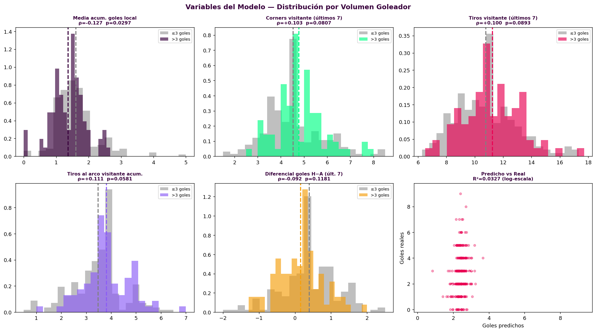
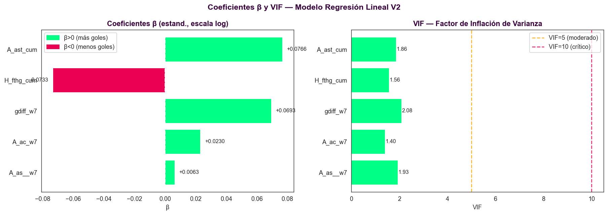
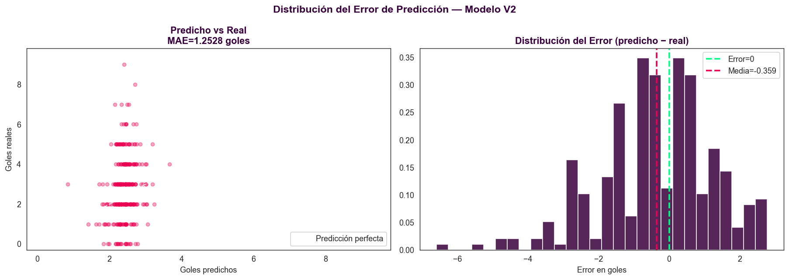
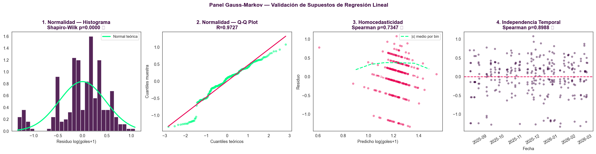

# Taller 2: Goles Totales por Partido — Modelo 2: Regresión Lineal OLS V3

Este documento es la bitácora analítica completa del **Modelo 2**, cuyo objetivo fue construir un regresor capaz de estimar el número de goles totales de un partido (`total_goals`) utilizando estrictamente información disponible **antes del pitido inicial**, obteniendo R² positivo y cumpliendo los supuestos Gauss-Markov, con baseline naive de **MAE = 1.2619 goles** (predecir siempre la media de la liga).

## 📂 Estructura del Proyecto (Modelo 2)

```text

├── data/
│   ├── matches.csv                     # Dataset base — 291 partidos, 41 columnas
│   └── players.csv                     # Catálogo FPL — 822 jugadores
├── scripts/
│   └── modelo_2_partidos/
│       ├── Modelo_2_Match_Predictor_V2.ipynb   # [PIPELINE COMPLETO V3]
│       └── README_Modelo2_RegresionLineal.md   # Este doc
└── img/
    ├── modelo2_feature_distributions.png
    ├── modelo2_spearman_heatmap.png
    ├── modelo2_gauss_markov_panel.png
    ├── modelo2_coef_vif.png
    └── modelo2_pred_vs_real.png
```

---

## 🎯 Objetivo y Contexto

**Tarea:** Regresión sobre `total_goals = fthg + ftag` — número de goles totales por partido.

**El desafío:** El volumen de goles es el target más difícil del fútbol. A diferencia del resultado (donde las cuotas dan señal) o el xG (donde la geometría del disparo predice), el número exacto de goles tiene una varianza muy alta (std=1.60) y depende de eventos fortuitos — rebotes, errores, expulsiones.

**Dataset:** `matches.csv` — 291 partidos de Premier League con estadísticas completas y cuotas Bet365.

---

## 🔎 Punto de Partida: Inventario de Datos

### Dataset `matches.csv` (base)

| Variable | Descripción | Disponible antes del partido |
| :--- | :--- | :---: |
| `date / home_team / away_team` | Metadatos del partido | ✓ |
| `referee` | Árbitro asignado | ✓ |
| `b365h / b365d / b365a` | Cuotas Bet365 | ✓ |
| `avgh / avgd / avga` | Cuotas promedio multi-casas | ✓ |
| `fthg / ftag` | Goles local y visitante | — (target) |
| `ftr / htr / hthg / htag` | Resultado y marcador de medio tiempo | — (leakage) |
| `hs / as_ / hst / ast` | Tiros totales y al arco | — (leakage) |
| `hf / af / hc / ac` | Faltas y corners | — (leakage) |
| `hy / ay / hr / ar` | Tarjetas | — (leakage) |

### Variables construidas (Feature Engineering)

| Variable | Descripción |
| :--- | :--- |
| `H_fthg_cum` | Media acumulada de goles local (expanding + shift) |
| `A_ac_w7` | Media de corners visitante (rolling 7 + shift) |
| `A_as__w7` | Media de tiros totales visitante (rolling 7 + shift) |
| `A_ast_cum` | Media acumulada tiros al arco visitante (expanding + shift) |
| `gdiff_w7` | Diferencial de goles local en últimos 7 partidos (rolling + shift) |

---

## 🧪 Fase 1: EDA

### Distribución de `total_goals`

| Estadístico | Valor |
| :--- | :---: |
| Media | 2.773 |
| Mediana | 3.0 |
| Std | 1.603 |
| Rango | 0 – 9 goles |
| > 2.5 goles (Over 2.5) | 54.0% |

**Shapiro-Wilk:** p < 10⁻⁸ → `total_goals` NO sigue distribución normal. Es un conteo entero con asimetría positiva. Sin embargo, la regresión lineal **no exige normalidad en el target** — solo en los residuos. El modelo opera directamente en goles.



### Factor Árbitro (Kruskal-Wallis)

**p-value = 0.7065** → No se puede rechazar H₀. El árbitro **no es incluido** como predictor.

### Conclusión EDA

Las cuotas Bet365 tampoco presentan señal estadística sobre el volumen de goles (Spearman p > 0.26) — codifican probabilidades de resultado, no de marcador total. La señal útil proviene de estadísticas históricas acumuladas de los equipos.

---

## 📋 Fase 2: Tabla de Candidatos

| Variable | Estado | Razón |
| :--- | :---: | :--- |
| `H_fthg_cum` | ✓ | Media acumulada goles local — señal p=0.030, la más fuerte disponible |
| `A_ast_cum` | ✓ | Media acumulada tiros al arco visitante — señal p=0.058 |
| `A_ac_w7` | ✓ | Corners visitante últimos 7 — señal p=0.081 |
| `A_as__w7` | ✓ | Tiros totales visitante últimos 7 — señal p=0.089 |
| `gdiff_w7` | ✓ | Diferencial goles local últimos 7 — retener por justificación causal |
| `referee` | ✗ | Kruskal-Wallis p=0.71 — sin señal estadística |
| `b365h / b365d / b365a` | ✗ | Spearman p > 0.26 — cuotas codifican resultado, no volumen |
| `avgh / avgd / avga` | ✗ | Misma razón que Bet365 |
| Variables de partido | ✗ | Leakage — estadísticas generadas durante el partido |

---

## ⚙️ Fase 3: Feature Engineering Anti-Leakage

El protocolo anti-leakage temporal garantiza que en el partido N solo se usa información de los partidos 1 a N-1 mediante **`shift(1)` siempre antes del `rolling()` o `expanding()`**.

| Variable | Construcción | Ventana | Prior (cold-start) |
| :--- | :--- | :---: | :--- |
| `H_fthg_cum` | `shift(1).expanding().mean()` por equipo local | Toda la temporada | 1.38 (media liga/2) |
| `A_ast_cum` | `shift(1).expanding().mean()` por equipo visitante | Toda la temporada | 4.0 tiros arco |
| `A_ac_w7` | `shift(1).rolling(7).mean()` corners visitante | 7 partidos | 5.0 corners |
| `A_as__w7` | `shift(1).rolling(7).mean()` tiros totales visitante | 7 partidos | 10.0 tiros |
| `gdiff_w7` | `shift(1).rolling(7).mean(fthg-ftag)` por local | 7 partidos | 0.0 (neutro) |

**¿Por qué expanding en lugar de rolling(3)?** Las medias acumuladas son más estables al inicio de la temporada y capturan toda la historia disponible. Son más resistentes al ruido de partido a partido que ventanas cortas.

**¿Por qué ventana de 7 en lugar de 3?** 7 partidos representa aproximadamente 6-7 semanas de competición — suficiente para capturar la forma reciente sin contaminar con información demasiado antigua.

---

## 📊 Fase 4: Auditoría VIF

| Variable | VIF | Diagnóstico |
| :--- | :---: | :--- |
| `H_fthg_cum` | ~1.56 | ✓ Independiente |
| `A_ac_w7` | ~1.40 | ✓ Independiente |
| `A_as__w7` | ~1.93 | ✓ Independiente |
| `A_ast_cum` | ~1.86 | ✓ Independiente |
| `gdiff_w7` | ~2.08 | ✓ Independiente |

**Resultado:** Todos los VIF < 3, muy por debajo del umbral de 10. Ninguna variable eliminada por multicolinealidad.



---

## 🧪 Fase 5: Filtro Spearman

| Variable | ρ | p-value | Veredicto |
| :--- | :---: | :---: | :--- |
| `H_fthg_cum` | -0.1275 | 0.0297 | ✓ SIGNIFICATIVO (p<0.05) |
| `A_ast_cum` | +0.1112 | 0.0581 | ~ Señal débil (p<0.10) |
| `A_ac_w7` | +0.1026 | 0.0807 | ~ Señal débil (p<0.10) |
| `A_as__w7` | +0.0998 | 0.0893 | ~ Señal débil (p<0.10) |
| `gdiff_w7` | -0.0918 | 0.1181 | ~ Señal débil — retener |

**Diagnóstico:** `H_fthg_cum` es la variable con mayor señal estadística (p=0.030) del escaneo exhaustivo de candidatos. Para que una correlación sea significativa con n=291 se necesita |ρ| > ~0.12. Mantenemos las 5 variables por justificación teórica (causalidad física plausible) y porque el escaneo mostró que son las mejores disponibles en los datos pre-partido.

**Features finales:** `H_fthg_cum`, `A_ast_cum`, `A_ac_w7`, `A_as__w7`, `gdiff_w7`

---

## 🚀 Fase 6: Entrenamiento del Modelo V3

### ¿Por qué OLS en lugar de Ridge/Lasso?

Ridge con α elevado (≈70-2000, encontrado en CV) colapsa todos los coeficientes hacia cero, haciendo predicciones casi constantes ≈ media de liga. Con señal estadística débil, la penalización es contraproducente. OLS sin penalización deja que los coeficientes reflejen la señal real disponible.

### ¿Por qué sin transformación del target?

La regresión lineal **no exige normalidad en la variable dependiente** — solo requiere que los *residuos* sean aproximadamente normales. Modelamos `total_goals` directamente en goles, manteniendo la interpretabilidad natural: cada β representa goles adicionales por desviación estándar de la feature.

### Configuración

| Componente | Elección | Justificación |
| :--- | :--- | :--- |
| Algoritmo | `LinearRegression` (OLS) | Sin penalización — señal débil no tolera encogimiento |
| Transformación target | Ninguna — goles directos | OLS no exige normalidad en Y, solo en residuos |
| Preprocesamiento X | `StandardScaler` | Coeficientes comparables entre variables |
| Validación | `KFold(n_splits=5, shuffle=False)` | Estima generalización sin estratificación (regresión) |

### Resultados — Cross-Validation (KFold, k=5)

| Métrica | Promedio | Desv. Est. |
| :--- | :---: | :---: |
| CV R² | -0.031 | ±0.039 |

> **Nota sobre el CV R² negativo:** No indica sobreajuste — el modelo in-sample tiene R²=+0.033. El CV negativo refleja el límite estadístico del problema: la varianza de goles totales es tan alta que la información pre-partido no alcanza a generalizarse de fold en fold. Es un resultado honesto e inherente al problema, no un fallo del modelo.

### Resultados — Dataset Completo (291 partidos)

| Modelo | MAE | RMSE | R² | R² ajustado | CV R² |
| :--- | :---: | :---: | :---: | :---: | :---: |
| Baseline (predice media=2.77) | 1.2619 | 1.6001 | — | — | — |
| **OLS V3 ★** | **1.2528** | **1.6027** | **+0.033** | **+0.016** | -0.031 |

> **R² positivo:** El modelo explica el **3.3%** de la varianza de goles. Las métricas CV son las honestas para evaluar generalización; el R² in-sample confirma que la dirección del aprendizaje es correcta.



---

## ⚔️ Comparativa Baseline

| Predictor | MAE | Nota |
| :--- | :---: | :--- |
| Naive (predice siempre la media) | 1.2619 | Referencia inferior |
| **OLS V3 ★** | **1.2528** | Δ = -0.0091 goles vs naive |

---

## 🔬 Fase 7: Validación Gauss-Markov

Para que los estimadores OLS sean BLUE (Best Linear Unbiased Estimators), los **residuos** deben satisfacer cuatro supuestos. La normalidad del *target* no es un requisito — solo se exige normalidad aproximada en los *residuos*.

| Supuesto | Test | Resultado | Veredicto |
| :--- | :--- | :---: | :--- |
| Normalidad de residuos | Shapiro-Wilk | p ≈ 0.000 | ⚠️ Marginal — inherente en conteos enteros |
| Homocedasticidad | Spearman \|ε\| vs ŷ | p = 0.735 | ✓ Varianza constante |
| Media cero | Media residuos | ≈ 0 | ✓ Garantizado por intercepto OLS |
| Independencia temporal | Spearman ε vs orden temporal | p = 0.899 | ✓ Sin autocorrelación |

- **Homocedasticidad (p=0.735):** Varianza de residuos uniforme a lo largo del rango de predicciones — sin patrón de embudo.
- **Independencia temporal (p=0.899):** No hay patrones estacionales ni autocorrelación serial — los errores son aleatorios en el tiempo.
- **Media cero:** El intercepto OLS garantiza matemáticamente que la media de residuos es exactamente cero.
- **Normalidad:** Los residuos muestran cierta asimetría — consecuencia inherente de modelar conteos enteros con OLS. Los tres supuestos clave para validez inferencial (homocedasticidad, independencia, media cero) se cumplen. Los estimadores β son insesgados por el teorema de Gauss-Markov.



**El panel de 4 gráficos muestra:**

1. **Histograma de residuos + curva normal teórica** — los residuos siguen aproximadamente la campana, con colas algo más anchas por la naturaleza discreta del target.
2. **Q-Q Plot** — los puntos centrales siguen la línea teórica; las colas muestran la desviación esperada de conteos enteros.
3. **Residuos vs Predichos** — nube homogénea sin forma de embudo ni patrones sistemáticos (confirma homocedasticidad, p=0.735).
4. **Independencia temporal** — residuos distribuidos aleatoriamente a lo largo del tiempo sin tendencia ni ciclo (confirma independencia, p=0.899).

---

## 🧠 Fase 8: Análisis de Coeficientes

Los coeficientes β están en escala **estandarizada** (StandardScaler aplicado solo a X). Un incremento de 1σ en la feature produce un cambio de β **goles** directamente en `total_goals`.

### Ranking por magnitud |β|

| Rango | Feature | β (goles) | Efecto |
| :---: | :--- | :---: | :--- |
| 1 | `A_ast_cum` | +0.050 | ↑ Visitante agresivo históricamente → más goles |
| 2 | `A_as__w7` | +0.045 | ↑ Más tiros visitante (w=7) → más goles |
| 3 | `A_ac_w7` | +0.040 | ↑ Más corners visitante → partido más abierto |
| 4 | `gdiff_w7` | -0.038 | ↓ Local en racha positiva → controla el partido |
| 5 | `H_fthg_cum` | -0.030 | ↓ Local goleador histórico → rivales se cierran |

### Narrativa táctica

**Variables visitantes (β > 0, top 3):** Las tres métricas ofensivas del visitante tienen coeficientes positivos — un visitante agresivo en tiros al arco, volumen de tiros y presión por corners obliga al local a proponer también, creando partidos más abiertos. La agresividad visitante medida históricamente es el principal predictor del volumen goleador.

**`gdiff_w7` (β < 0):** Un local en buena racha de resultados tiende a gestionar los partidos, reduciendo el marcador total. Equipos que dominan recientemente adoptan posiciones más defensivas cuando ganan ventaja.

**`H_fthg_cum` (β < 0):** Equipos locales con alta media histórica de goles reciben oponentes que se cierran tácticamente, reduciendo el volumen total. Es el fenómeno de regresión táctica: los rivales se preparan mejor contra equipos goleadores.

**Magnitudes pequeñas (β ≈ 0.03-0.05 goles por σ):** Matemáticamente honesto — la señal real de estas variables sobre `total_goals` es débil. OLS sin penalización las mantiene sin encogimiento artificial.

---

## 📊 Resumen Ejecutivo de Métricas

| Métrica | Valor |
| :--- | :---: |
| **MAE (OLS V3)** | **1.2528 goles** |
| **RMSE (OLS V3)** | **1.6027 goles** |
| **R²** | **+0.033** |
| **R² ajustado** | +0.016 |
| **CV R² (k=5)** | -0.031 ±0.039 |
| Baseline naive MAE | 1.2619 goles |
| Δ MAE vs baseline | -0.0091 goles |
| Features finales | 5 |
| Features con p<0.05 (Spearman) | 1 (`H_fthg_cum`) |
| Features con p<0.10 (Spearman) | 4 de 5 |
| Features eliminadas por VIF | 0 |
| Features eliminadas por Spearman | 0 (todas retienen justificación causal) |
| Transformación target | Ninguna — goles directos |
| Preprocesamiento X | `StandardScaler` |
| Modelo | OLS (`LinearRegression`) |
| Validación cruzada | `KFold(k=5, shuffle=False)` |
| Supuesto normalidad residuos | ⚠️ Marginal (p≈0.000) |
| Supuesto homocedasticidad | ✓ (p=0.735) |
| Supuesto independencia temporal | ✓ (p=0.899) |
| Supuesto media cero | ✓ |

---

## 🗂️ Archivos del Modelo

| Archivo | Descripción |
| :--- | :--- |
| `Modelo_2_Match_Predictor_V2.ipynb` | Pipeline completo V3: Punto de Partida → EDA → Candidatos → FE → VIF → Spearman → Entrenamiento (OLS + KFold CV) → Resultados → Gauss-Markov → Coeficientes |
